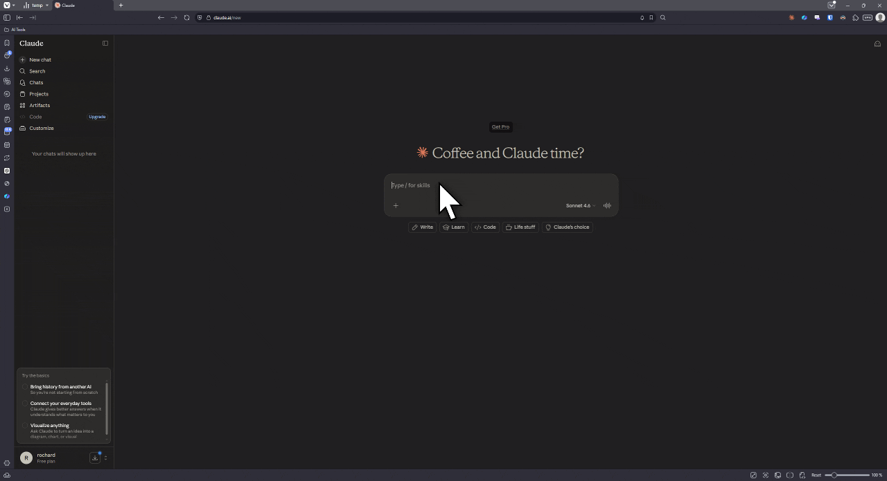

# Threads

Add inline side threads to chatbot conversations in Chromium browsers.

Threads lets you branch off a specific message block, ask a focused follow-up, and keep that exchange beside the original conversation instead of sending everything via the main chat.

Threads is an unofficial browser extension for chatbot web apps. It is not affiliated with Anthropic, OpenAI, DeepSeek, or any other chatbot provider.

## Demo



## Features

- Open a side thread from a chatbot response block.
- Keep multiple thread panels aligned with the blocks they reference.
- Reply inside a thread without interrupting the main chat flow.
- Include or exclude individual threads from generated context summaries.
- Persist threads per conversation with Chrome extension storage.
- Inject selected thread summaries into chatbot requests when you continue the main conversation.

## Supported Sites

| Site | Status |
| --- | --- |
| Claude by Anthropic (`claude.ai`) | Supported |
| ChatGPT by OpenAI (`chatgpt.com`) | Planned |
| DeepSeek (`chat.deepseek.com`) | Planned |

This build currently ships the Claude adapter only. ChatGPT and DeepSeek support are planned behind the same platform adapter model.

## Browser Support

Threads is a Manifest V3 extension built for Chrome and Chromium-based browsers. Firefox support has not been tested.

## Development

Start Vite in extension development mode:

```sh
npm run dev
```

Then load the generated development extension from `dist/` in `chrome://extensions`. After code changes, refresh the extension and reload the supported chatbot tab if the content script does not update automatically.

Common commands:

```sh
npm run build       # typecheck and build the extension
npm run typecheck   # run TypeScript without emitting files
npm test            # run the Vitest suite
npm run test:watch  # run tests in watch mode
```

## Project Structure

```text
src/content/           Preact content UI and thread state
src/fetch-watcher/     page-world fetch interception and summary injection
src/platforms/claude/  Claude DOM, network, and theme adapters
manifest.config.ts     MV3 extension manifest
vite.config.ts         Vite, CRX, and zip packaging config
```

## Data Handling

Threads is designed to run locally in the browser. It does not add a backend service and does not send your thread data to a server controlled by this project.

What the extension stores locally:

- Thread messages you write in side threads.
- Assistant replies shown inside side threads.
- The quoted response block associated with each thread.
- Whether a thread is open and whether it is included in summaries.
- Per-conversation thread state in Chrome extension storage.
- Endpoint metadata needed to continue the side-thread workflow on supported chatbot sites.

Data stays subject to the chatbot provider you use. For example, Claude data is handled by Anthropic, ChatGPT data by OpenAI, and DeepSeek data by DeepSeek according to their respective terms and privacy policies.

## Compatibility Notice

Threads modifies the local browser experience for supported chatbot websites. Use is subject to the terms, privacy policies, and acceptable-use rules of the chatbot provider you use.

## Permissions

- `storage`: saves thread state and endpoint metadata locally.
- Supported chatbot host permissions: inject the content UI and page-world fetch watcher only on declared chatbot domains.

## Contributing

Keep platform-specific behavior behind adapters in `src/platforms/`. Shared UI and persistence logic should stay in `src/content/`, and request interception should stay in `src/fetch-watcher/`.

Before opening a pull request, run:

```sh
npm run typecheck
npm test
```

## License

Licensed under the [PolyForm Noncommercial License 1.0.0](https://polyformproject.org/licenses/noncommercial/1.0.0/).

Commercial use is not permitted without prior written permission.

See [LICENSE.md](LICENSE.md) for details.
